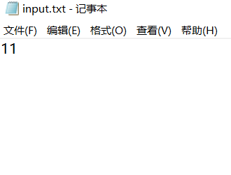
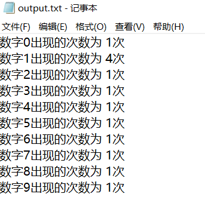

## 题目描述

一本书的页码从自然数1开始顺序编码直到自然数n。书的页码 按照通常的习惯编排，一个页码内都不包含多余的前导数字0.例如，第6页用数字6表示，而不是06或006等；数字计数问题要求给定书的总页码n，计算出书的全部页码中分别用到多少次数字0，1，……9。

### 算法设计

给定表示书的总页码的十进制整数 n ($1 \leq n \leq 10的9次方$), 计算书的全部页码中分别用到多少次数字0, 1, 2, 3, 4, 5, 6, 7, 8, 9。

### 数据输入

输入数据由文件名为input.txt的文本文件提供。每个文件只有一行，给出表示书的总页码的整数n。

#### 输入文件示例



### 结果输出

程序运行结束时，将计算结果输出到文件output.txt中。输出文件共有10行，在地k行输出页码中用到的数字（k-1）的次数，k=1，2，……10.

#### 输出文件示例



## 题目分析


### 代码 
```c
#include<stdio.h>
#include<stdlib.h>
int a[10]={0};	
void count(int n)
{
    while (n > 0)
    {
        a[n%10] += 1;
        n = n/10;
    }
}
int main()
{
	int i,j,n;
	freopen("D:\\002算法设计与分析\\001算法设计与分析实验题\\input.txt", "r", stdin);           
	freopen("D:\\002算法设计与分析\\001算法设计与分析实验题\\output.txt","w",stdout) ; 
    int temp;
	scanf("%d",&temp);              
	for(i=1;i<=temp;i++) 
	{
	 count(i); 
    }
	 for(j=0;j<=9;j++)
	{
	    printf("数字%d出现的次数为 %d次\n",j,a[j]);
	}	         
}

```